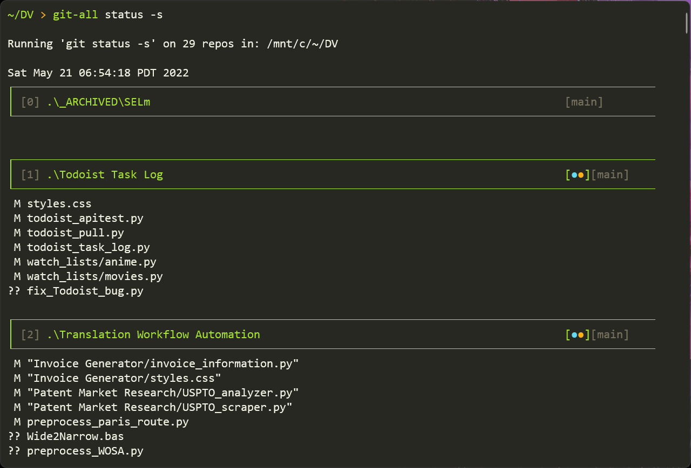

# Scripts
This is just a staging ground for random tools, WIP ideas, and scratch files. Most things born here eventually grow up and move somewhere else :) .

Notable tools that have stuck around:

- [`git-all`](#git-all---run-git-commands-on-multiple-repos-at-once) - Run git commands on multiple repos at once

## `git-all`
`git-all.zsh` is a thin git wrapper that recursively finds git repos in the current working directory and runs git commands on any repos that were found.

`git-all` uses the lovely [`fd`](https://github.com/sharkdp/fd) for faster directory traversal, so `fd` must be installed and available on your PATH.

Slow (networked) commands such as `push`, `pull`, and `fetch` are executed multi-threaded, while fast (local) commands such as `log` and `commit` are executed single-threaded to preserve output order.

Command syntax is exactly the same as regular `git`. Here are a few useful commands for batch repo work:

- `git-all fetch && git-all status -s` - Fetch latest updates from all remotes and show repo status.
- `git-all commit -am "Commit message"` - Commit all tracked files in all repos with the same commit message.
- `git-all push` - Push all repos to their respective remotes (multi-threaded).
- `git-all pull` - Pull latest updates from all repo remotes (multi-threaded).

Output for single-threaded commands like `status` is pretty-printed with [posh git headers](https://joshdick.net/2017/06/08/my_git_prompt_for_zsh_revisited.html):

## License
MIT. Have fun :) .
