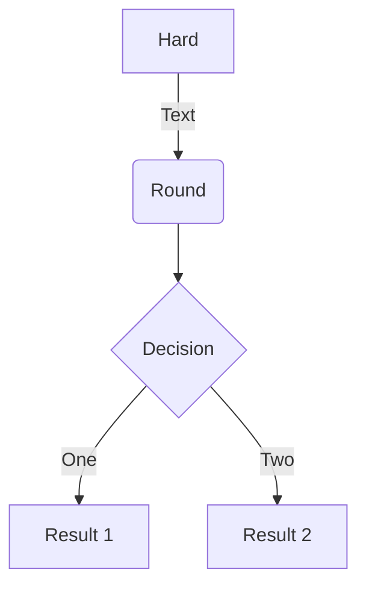
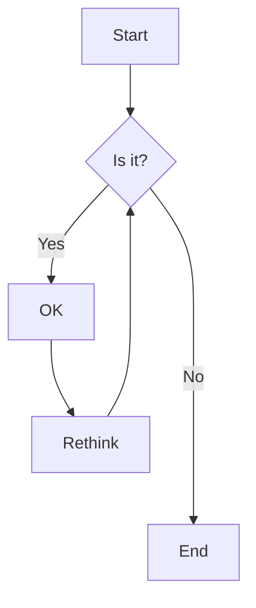
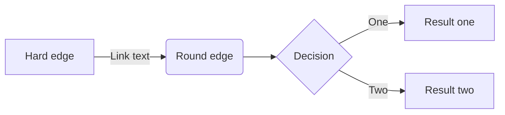
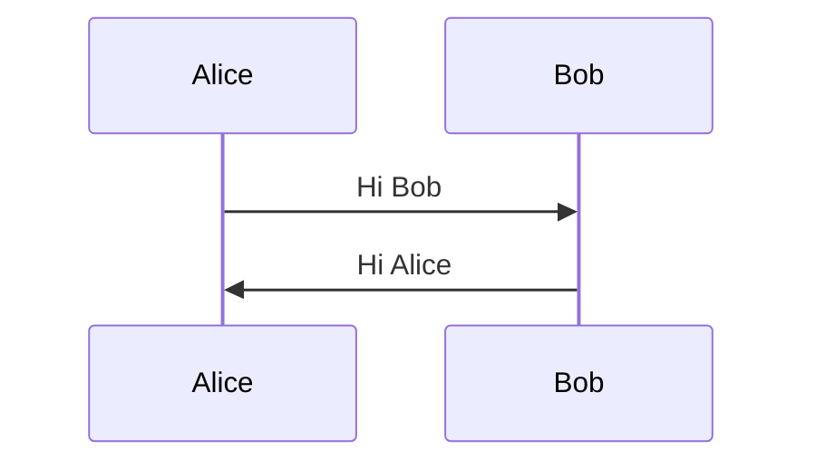
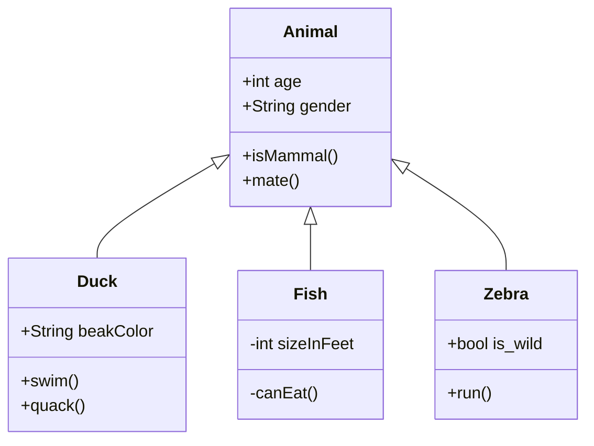
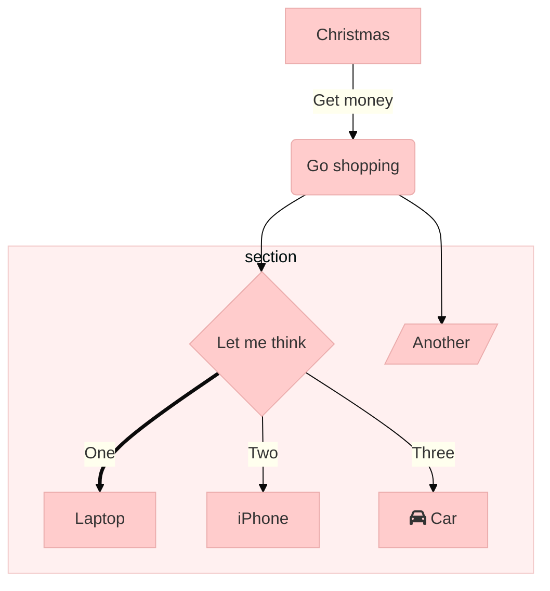
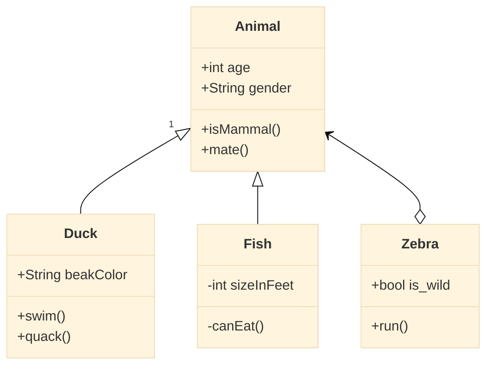

$a = \sin^{2}(\Delta \phi/2) + \cos(\phi_{1})\cos(\phi_{2})\sin^{2}(\Delta \lambda/2)$
$c = 2 \arcsin(\sqrt{a})$
$d = rc$

```sequence
Title: Here is a title
A->B: Normal line
B-->C: Dashed line
C->>D: Open arrow
D-->>A: Dashed open arrow
```

```sequence
Andrew->China: Says Hello
Note right of China: China thinks\nabout it
China-->Andrew: How are you?
Andrew->>China: I am good thanks!
```

```sequence
# Example of a comment.
Note left of A: Note to the\n left of A
Note right of A: Note to the\n right of A
Note over A: Note over A
Note over A,B: Note over both A and B
```

```sequence
participant C
participant A
participant B
Note right of B: By listing the participants\n you can change their order
```

```flow
st=>start: Start:>http://www.google.com[blank]
e=>end:>http://www.google.com
op1=>operation: My Operation
sub1=>subroutine: My Subroutine
cond=>condition: Yes
or No?:>http://www.google.com
io=>inputoutput: catch something...

st->op1->cond
cond(yes)->io->e
cond(no)->sub1(right)->op1
```














